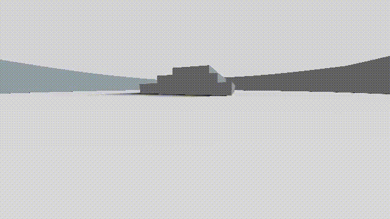

# Dygra
Dygra is a real-time non-euclidean ray-tracer. Dygra is meant to be used with Azathoth, a custom built level editor - [https://github.com/rameshvarun/azathoth](https://github.com/rameshvarun/azathoth "Azathoth")

## Videos
Some Basic Levels - [http://youtu.be/ywZNsu-tZo0](http://youtu.be/ywZNsu-tZo0)

Demo with Commentary - [http://youtu.be/YvU-srHhQxw](http://youtu.be/YvU-srHhQxw)
